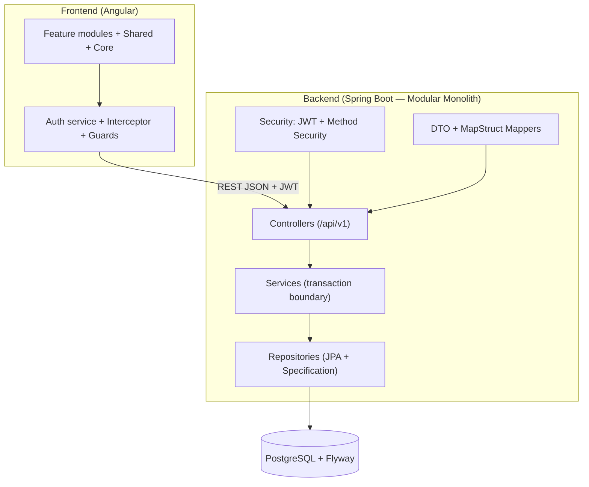

# PM Daily Work Management — Tổng quan dự án

> Tài liệu gốc: `docs/00-project-overview.md`
> Trạng thái: cập nhật 2026-08-10 — **v1.0.0 PHÁT HÀNH HOÀN CHỈNH** (Prompt 02–24 đều ✔): Backend 222 tests PASS, Frontend 19 tests + build PASS, Docker Compose 3 container Up + smoke E2E 15/15 PASS, tài liệu release đầy đủ.
> Giai đoạn hiện tại: **v1.1 — PROJECT PLANNING** (tài liệu planning hoàn tất `docs/planning/01..15` + `docs/api/13-planning-api.md`; **PLN-BE-01..10 backend đều ✔ 2026-08-07/08 — 281 tests PASS**). **Frontend module `planning` PLN-FE-01..10 ĐÃ HOÀN TẤT ✔ 2026-08-10/11** (Gantt UI tự dựng SVG, license đã chốt — docs/planning/13 §4; npm test 73 PASS). Backlog v1.1 còn: E2E framework (Playwright), export CSV streaming, tối ưu SCSS budget — chi tiết `docs/status-report-2026-08-10.md`.

## 1. Mục tiêu sản phẩm

Ứng dụng quản lý công việc hằng ngày dành cho quản lý dự án phần mềm (PM), cung cấp một nơi duy nhất để PM nắm toàn cảnh tình trạng dự án và công việc hằng ngày:

- Theo dõi công việc hằng ngày: hạn hoàn thành, quá hạn, sắp đến hạn, blocker, tiến độ.
- Quản lý dự án, thành viên dự án và phân vai trò trong dự án.
- Quản lý cuộc họp, biên bản, action item và chuyển action item thành task.
- Quản lý risk, issue, quyết định, milestone.
- Nhắc việc (in-app) và báo cáo tiến độ.
- Nhật ký hoạt động (audit log) cho các hành động quan trọng.

Mục tiêu phiên bản đầu: ứng dụng nội bộ, đơn giản, dễ bảo trì, chạy được local trên Windows bằng Docker Compose (hoặc thủ công Maven + npm).

## 2. Người dùng

| Vai trò | Mô tả |
|---|---|
| `ADMIN` | Quản trị hệ thống: tài khoản, vai trò, quyền; có thể xem/thao tác toàn bộ dữ liệu. |
| `PROJECT_MANAGER` | Quản lý dự án: tạo/sửa dự án, giao việc, tổ chức họp, quản lý risk/issue/milestone, xem báo cáo. |
| `PROJECT_MEMBER` | Thành viên dự án: thực hiện và cập nhật công việc được giao, tham gia họp, theo dõi risk/issue liên quan. |
| `VIEWER` | Chỉ xem thông tin, không thao tác. |

Chi tiết phân quyền: `docs/05-user-roles-permissions.md` (Prompt 02).

## 3. Phạm vi

### Trong phạm vi (v1)

1. Đăng nhập và quản lý tài khoản (JWT, refresh token, đổi mật khẩu, reset mật khẩu bởi Admin).
2. Dashboard công việc hằng ngày của PM (kèm biểu đồ và filter dự án/thời gian).
3. Quản lý dự án (CRUD, thành viên, vai trò trong dự án, xóa mềm).
4. Quản lý thành viên dự án.
5. Quản lý công việc (task): CRUD, giao việc, trạng thái, tiến độ, blocker, task cha/con, bình luận, file đính kèm, lịch sử, tìm kiếm/lọc/phân trang/sắp xếp, xuất Excel.
6. Quản lý công việc cá nhân của PM (task của tôi, task hôm nay, task quá hạn).
7. Quản lý cuộc họp (meeting) và người tham gia.
8. Quản lý biên bản và action item (bao gồm chuyển action item thành task).
9. Quản lý rủi ro (risk).
10. Quản lý vấn đề (issue).
11. Quản lý quyết định (decision — lưu trong phạm vi ghi nhận/history nếu cần).
12. Quản lý milestone.
13. Quản lý nhắc việc (in-app notification; scheduled job sinh thông báo deadline/overdue).
14. Báo cáo tiến độ (theo trạng thái, theo người thực hiện, quá hạn, tiến độ dự án, risk/issue; export CSV/Excel nếu thư viện ổn định).
15. Nhật ký hoạt động (audit log).

### Trong phạm vi (v1.1 — PROJECT PLANNING, chưa triển khai code)

1. Project Plan (Master/Detail/Template Instance) + vòng đời trạng thái (DRAFT → SUBMITTED → APPROVED → ACTIVE → COMPLETED).
2. WBS: cây task (PHASE/SUMMARY/WORK_PACKAGE/TASK/MILESTONE/EXTERNAL_TASK), wbsCode tự đánh số, roll-up tiến độ theo trọng số effort.
3. Dependency FS/SS/FF/SF + lag, kiểm tra vòng lặp, trigger auto scheduling.
4. Working calendar (organization + project, exceptions, fallback).
5. Scheduling engine: forward pass theo dependency + calendar, task AUTO/MANUAL, warnings.
6. Critical path (CPM forward/backward pass, float, isCritical).
7. Resource planning: gán user/team/role/external, workload, cảnh báo over-allocation (không leveling).
8. Version plan (snapshot) & Baseline (bất biến, chỉ APPROVED) + variance.
9. Change history sau APPROVED (kèm change suggestion từ execution/issue/risk).
10. plan_links: liên kết planning task ↔ execution task / issue / risk.
11. Template plan (8 template mặc định, 17 phase).
12. Portfolio: timeline đa dự án, tổng hợp tiến độ, cảnh báo trễ & over-allocation chéo dự án.
13. Gantt UI (bảng WBS + timeline; **đã chốt tự dựng SVG, không dependency** — docs/planning/13 §4).

### Ngoài phạm vi (v1)

- Mobile app, realtime (WebSocket), email/SMS notification.
- CI/CD production, deploy cloud, multi-tenancy, đa ngôn ngữ.
- Quản lý quyết định tách module riêng (v1 ghi nhận qua audit/notes).

### Ngoài phạm vi (v1.1 — Project Planning)

- Resource leveling tự động (chỉ cảnh báo over-allocation).
- Multi-level Detail Plan (detail của detail) — chỉ 1 cấp.
- Backward pass đẩy lịch (chỉ dùng cho critical path float).
- Scope baseline (baseline theo phần WBS) — baseline toàn plan.
- Export/import WBS Excel (đánh dấu giai đoạn sau).
- Gantt trên mobile (cho phép cuộn ngang).

## 4. Công nghệ

| Tầng | Công nghệ |
|---|---|
| Backend | Java 21, Spring Boot 3.x, Spring Security + JWT, Spring Data JPA, PostgreSQL, Flyway, Lombok, MapStruct, Bean Validation, Maven |
| API doc | Swagger/OpenAPI (springdoc) |
| Test Backend | JUnit 5, Mockito, Spring Boot Test, Testcontainers (nếu phù hợp) |
| Frontend | Angular (bản stable tương thích Node hiện tại), Angular Material, Reactive Forms, HttpClient, Route Guard, HTTP Interceptor, SCSS, Responsive desktop/tablet |
| Test Frontend | Jasmine/Karma hoặc Jest |
| Local deploy | Docker, Docker Compose (postgres, backend, frontend/Nginx), hoặc chạy thủ công (Maven, npm) |
| DB migration | Flyway (`V1__init_schema.sql`, `V2__seed_local_data.sql`) |

## 5. Kiến trúc tổng thể

- **Modular Monolith** cho phiên bản đầu.
- **Backend**: Layered Architecture rõ ràng theo module nghiệp vụ — `controller → service → repository`, kèm `entity / dto / mapper / specification` trong từng module.
- **Frontend**: feature modules (`core`, `shared`, `layout`, `auth`, `dashboard`, `projects`, `tasks`, `meetings`, `risks`, `issues`, `milestones`, `reports`, `administration`).
- **REST API**: prefix `/api/v1`, JSON, ISO-8601, pagination chuẩn (`page`, `size`, `sort`), error response thống nhất.
- **Authentication**: JWT access token (sống ngắn) + refresh token (sống dài hơn, lưu DB, có revoke); BCrypt cho mật khẩu; permission-based authorization.
- **Dữ liệu**: optimistic locking (`version`), soft delete cho dữ liệu nghiệp vụ, `createdAt/createdBy/updatedAt/updatedBy`, UUID PK, lưu giờ UTC — UI hiển thị theo múi giờ người dùng.
- **Quality**: global exception handler, trace ID, logging, không trả Entity qua API (DTO + MapStruct), audit log cho hành động quan trọng.



## 6. Danh sách module

### Backend modules

`auth`, `user`, `project`, `project-member`, `task`, `comment`, `attachment`, `meeting`, `action-item`, `risk`, `issue`, `milestone`, `notification`, `dashboard`, `report`, `audit`, `planning` (v1.1: `plan`, `plan-version`, `plan-task`, `plan-dependency`, `plan-calendar`, `scheduling`, `critical-path`, `plan-resource`, `plan-baseline`, `plan-change`, `plan-link`, `plan-template`, `portfolio`)

Kèm theo: `config`, `security`, `common`, `exception`.

### Frontend modules

`core`, `shared`, `layout`, `auth`, `dashboard`, `projects`, `tasks`, `meetings`, `risks`, `issues`, `milestones`, `reports`, `administration`, `planning` (v1.1: plan editor WBS/Gantt, portfolio)

## 7. Các giả định

1. Ứng dụng nội bộ, quy mô nhỏ–vừa (vài trăm người dùng), không cần scale phức tạp.
2. Giao diện và message hiển thị tiếng Việt.
3. Chỉ dùng in-app notification ở v1 — chưa có email.
4. State management Frontend dùng Angular service + RxJS — chưa dùng NgRx.
5. Không đa ngôn ngữ, không multi-tenant ở v1.
6. Chạy local trên Windows; Docker Desktop dùng cho Docker Compose.
7. Seed data chỉ dành cho local development; password demo không dùng cho production.
8. Admin là người khởi tạo tài khoản đầu tiên; không có chức năng đăng ký công khai.

## 8. Các rủi ro

1. **Nhiều module, thời gian dài** → triển khai tuần tự từng module hoàn chỉnh (code + test + doc) rồi mới chuyển bước.
2. **Sinh mã task tự động (`PRJ001-TASK-000001`)** cần an toàn concurrent → thiết kế sinh mã chống race condition; có test concurrent hoặc mô tả rõ giới hạn.
3. **Hiệu năng Dashboard/Report** khi dữ liệu lớn → aggregate tại DB, tránh N+1, không load toàn bộ dữ liệu lên bộ nhớ.
4. **Môi trường Windows local**: port conflict (5432/8080/4200/80), Docker resource, quyền thao tác file → có runbook xử lý lỗi.
5. **Test trải rộng cả hai stack** → giữ test ngắn, chạy thường xuyên, không xóa test khi fail.
6. **Thay đổi requirement giữa chừng** → tài liệu trong `docs/` là nguồn sự thật chính; mọi thay đổi phải cập nhật tài liệu trước.
7. **Không hard-code secret** → toàn bộ secret đọc từ environment variable; `.env` không commit.

## 9. Đề xuất cấu trúc thư mục

```text
pm-daily-work-management/
├── backend/
│   └── src/
│       ├── main/java/com/example/pmdaily/
│       │   ├── config/          # CORS, OpenAPI, JPA, scheduling
│       │   ├── security/        # JWT filter, UserDetails, method security
│       │   ├── common/          # Base entity, Base DTO, pagination, constants, utils
│       │   ├── exception/       # GlobalExceptionHandler, ErrorResponse
│       │   ├── auth/            # login/refresh/logout/me/change-password
│       │   ├── user/            # user + role + permission
│       │   ├── project/         # project + project-member
│       │   ├── task/            # task + comment + attachment
│       │   ├── meeting/         # meeting + action-item
│       │   ├── risk/
│       │   ├── issue/
│       │   ├── milestone/
│       │   ├── dashboard/
│       │   ├── notification/
│       │   ├── report/
│       │   └── audit/
│       ├── main/resources/
│       │   ├── db/migration/    # V1__init_schema.sql, V2__seed_local_data.sql
│       │   ├── application.yml
│       │   ├── application-local.yml
│       │   └── application-test.yml
│       └── test/
│   └── Dockerfile               # multi-stage
├── frontend/
│   └── src/app/
│       ├── core/                # auth service, interceptor, guards, error handler
│       ├── shared/              # shared components, pipes, directives
│       ├── layout/              # sidebar, header, main layout
│       ├── auth/                # login page
│       ├── dashboard/
│       ├── projects/
│       ├── tasks/
│       ├── meetings/
│       ├── risks/
│       ├── issues/
│       ├── milestones/
│       ├── reports/
│       └── administration/
│   ├── Dockerfile               # multi-stage + Nginx
│   └── nginx.conf
├── database/
│   ├── schema.sql               # tham chiếu cho Flyway migration
│   └── seed-data.sql            # tham chiếu seed local
├── docs/
│   ├── 00-project-overview.md   # tài liệu này
│   ├── 01-business-requirements.md
│   ├── 02-functional-requirements.md
│   ├── 03-non-functional-requirements.md
│   ├── 04-business-rules.md
│   ├── 05-user-roles-permissions.md
│   ├── 06-acceptance-criteria.md
│   ├── 07-requirement-traceability-matrix.md
│   ├── 08-v1.2-e2e-software-management.md  # phân hệ v1.2 E2E
│   ├── use-cases/
│   ├── design/
│   ├── database/
│   ├── api/
│   ├── testing/
│   ├── review/
│   └── release/
├── docker/                      # Dockerfile hỗ trợ, cấu hình bổ sung
├── scripts/                     # start-local.ps1, stop-local.ps1, reset-local.ps1, smoke-test.ps1
├── tests/api/                   # Postman collection, environment
├── docker-compose.yml
├── .env.example
├── .gitignore
└── README.md
```

## 10. Quy ước kỹ thuật chính (đã thống nhất)

1. Primary key dùng UUID; bảng dùng `snake_case`; ngày giờ dùng `timestamptz` (lưu UTC).
2. Bảng nghiệp vụ có `created_at, created_by, updated_at, updated_by`; có `version` cho optimistic locking.
3. Soft delete bằng `deleted_at`/`is_deleted` cho dữ liệu nghiệp vụ; bảng mapping không cần nếu không thiết yếu.
4. Không trả Entity qua API — dùng Request/Response DTO + MapStruct.
5. Error response thống nhất: `timestamp, status, error, code, message, path, fieldErrors, traceId`.
6. Không hard-code password/secret/connection — đọc từ environment variable; `.env` không commit.
7. Không viết TODO thay chức năng thật; không mock dữ liệu production.
8. Mọi chức năng có validation (Backend là nguồn chính, Frontend hiển thị lỗi tương ứng).
9. Audit log cho hành động quan trọng (login/logout, xóa mềm, thay đổi trạng thái...).
10. Frontend: chống double submit, xử lý 401/403, refresh token tránh gọi đồng thời, không log token.

## 11. Tài liệu liên quan

| Bước | Tài liệu | Trạng thái |
|---|---|---|
| Prompt 02 | `01/02/03/04/05-*.md` — requirement & phân quyền | ✔ Hoàn tất |
| Prompt 03 | `docs/use-cases/UC-001..013`, `06`, `07` | ✔ Hoàn tất |
| Prompt 04 | `docs/design/01..07` | ✔ Hoàn tất |
| Prompt 05 | `docs/database/*`, `database/schema.sql`, `database/seed-data.sql` | ✔ Hoàn tất |
| Prompt 06 | `docs/api/*`, `docs/api/openapi.yaml` | ✔ Hoàn tất |
| Prompt 07 | Skeleton: `backend/`, `frontend/`, `docker-compose.yml`, `.env.example`, `docs/build/environment-check.md` | ✔ Hoàn tất |
| Prompt 08 | Backend foundation: common, exception, config, security JWT, audit (test PASS 2026-08-02) | ✔ Hoàn tất |
| Prompt 09 | Auth module: login/refresh/logout/me/change-password/reset-password + user/role/permission (58 tests PASS 2026-08-02) | ✔ Hoàn tất |
| Prompt 10 | Project module: dự án + thành viên (CRUD, soft delete, BR-PROJ-01..10, 86 tests PASS 2026-08-02) | ✔ Hoàn tất |
| Prompt 11 | Task module: 25 endpoints theo `05-task-api.md` (CRUD, search lọc, state machine, tags/collaborators/watchers, comments, attachments, history, export Excel, mã tự sinh concurrent — BR-TASK-01..17, 133 tests PASS 2026-08-02) | ✔ Hoàn tất |
| Prompt 12 | Meeting module: 11 endpoints theo `06-meeting-api.md` (CRUD, today, complete khóa biên bản, participants, attachments dùng chung bảng — BR-MEET-01..06, 163 tests PASS 2026-08-02) | ✔ Hoàn tất |
| Prompt 13 | Risk & Issue module: 11 endpoints theo `08-risk-api.md` & `09-issue-api.md` (CRUD, ma trận level, convert-to-issue khi OCCURRED, resolvedAt auto, BR-RISK-01..04, BR-ISS-01..04, 194 tests PASS 2026-08-02) | ✔ Hoàn tất |
| Prompt 14 | Milestone module: 5 endpoints theo `10-milestone-api.md` (CRUD, status COMPLETED bắt buộc progress = 100, actualDate auto, BR-MIL-01..04, 195 tests PASS 2026-08-02) | ✔ Hoàn tất |
| Prompt 15 | Notification module & Scheduled Job: 4 endpoints theo `11-notification-api.md` (in-app notifications, unread-count, read/read-all, cron job task due soon/overdue, deduplicate, FR-NOTIF-01..03, 197 tests PASS 2026-08-02) | ✔ Hoàn tất |
| Prompt 16 | Dashboard, Report & Audit module: 10 endpoints theo `03-dashboard-api.md` & `12-report-audit-api.md` (summary 10 chỉ số, task stats, project progress, report status/assignee/overdue/progress/risk-issue, export CSV, audit logs query, FR-DASH-01, FR-REP-01..06, FR-AUD-01, 200 tests PASS 2026-08-02) | ✔ Hoàn tất |
| Prompt 17 | Frontend Core & Auth Foundation (Angular): Models, AuthService (JWT, Refresh single-flight), Interceptors, Guards, HasPermission Directive, Shared UI Components & Responsive LoginPage UI (npm run build & vitest PASS 2026-08-02) | ✔ Hoàn tất |
| Prompt 18 | Frontend Layout Shell & Main Navigation Architecture: MainLayout, Sidebar linh hoạt theo permission, Top Header, Notification Bell badge realtime & Dropdown panel, Shell Routing (npm run build & vitest PASS 2026-08-02) | ✔ Hoàn tất |
| Prompt 19 | Frontend Dashboard UI Page: Single-Fetch Realtime Integration, Lưới 10 Thẻ Chỉ số Summary, Cảnh báo màu đỏ/cam (Quá hạn/Blocker/High Risk), Biểu đồ Task Status/Priority & Tiến độ dự án (npm run build & vitest PASS 2026-08-02) | ✔ Hoàn tất |
| Prompt 20 | Frontend Project Feature Module: ProjectService (9 REST APIs), Màn hình Danh sách Dự án (Search, Filter, StatusChips, Modals Tạo/Sửa/Xóa mềm), Màn hình Chi tiết Dự án & Tab Quản lý Thành viên (npm run build & vitest PASS 2026-08-02) | ✔ Hoàn tất |
| Prompt 21 | Frontend Task Feature Module: TaskService đầy đủ (25 endpoints), Màn hình Danh sách Task (Kanban 6 cột, pagination, multi-select filter, date range, debounce search, delete modal, export Excel), Màn hình Chi tiết Task (hero header, 5 tabs: Mô tả/Bình luận edit/Upload đính kèm/Lịch sử/Task con, progress slider, 3 modals status-edit-delete — npm run build & vitest PASS 2026-08-03) | ✔ Hoàn tất |
| Prompt 22 | Frontend UI Modules & Basic Reports: Meeting (list, CRUD, complete, participants, attachments, action items), Risk/Issue (dual tab risks-issues), Milestone (COMPLETED progress 100%), Report UI (5 báo cáo & export CSV), Admin UI 3 tab basic, Admin API backend (16 tests) — (npm run build & vitest PASS, mvn test PASS 2026-08-03) | ✔ Hoàn tất |
| Prompt 23 | **Admin Module Enhancements**: Admin Service backend (POST /roles, PUT /roles/{id}, DELETE /roles/{id}, DELETE /users/{id}, DB migration `V3__admin_module_enhancements.sql` hỗ trợ user soft-delete & role `is_system` safety locks, 22 unit tests PASS), Frontend Admin UI & Integration (CRUD User soft delete, dialog Reset mật khẩu, CRUD Roles/Permission groups tùy chỉnh, dynamic permission preview UI trong User Modal) — (npm run build & vitest 19 tests PASS, mvn test 222 tests PASS 2026-08-03) | ✔ Hoàn tất |
| Prompt 24 | **Release v1.0.0**: Tài liệu bàn giao (`01-test-plan.md`, `02-code-review.md`, `03-release-notes.md`), kiểm chứng E2E smoke tests (15/15 PASS), Docker Compose build và kiểm chứng môi trường (environment-check) cho 3 container | ✔ Hoàn tất |
| Prompt Planning — Requirement | `docs/planning/01..15` (Business Requirements, FR, Business Rules, Permissions, Use Cases, Designs 06–13, Acceptance, Traceability) + `docs/api/13-planning-api.md` | ✔ Hoàn tất (2026-08-07) |
| PLN-BE-01 | **Project Plan module** (backend): module `plan` — ProjectPlan/PlanVersion + enums, CRUD (search, create, get, update, delete mềm), vòng đời submit/approve/activate, rules PLN-RULE-PLAN-01..05 (planCode unique, master–detail 1 cấp, 1 master APPROVED/ACTIVE, date range, optimistic lock), phân quyền plan:* + PM-dự-án, audit — 2 integration tests PASS (mvn clean verify + package: 224 tests) | ✔ Hoàn tất (2026-08-07) |
| PLN-BE-02 | **Plan Task / WBS module** (backend): module `plan` — bảng `plan_tasks` WBS, enums (PlanTaskType/Status/ScheduleMode/ConstraintType/Priority), cây phân cấp (PHASE → WORK_PACKAGE → TASK/MILESTONE), renumber `wbs_code` auto (1, 1.1, 1.1.2), roll-up summary (effort/duration/progress theo trọng số), thao tác move UP/DOWN/INDENT/OUTDENT/TO_PARENT, MILESTONE rules, kiểm tra vòng lặp cha-con, submit yêu cầu ≥ 1 task — PlanTaskIntegrationTest 3 tests PASS (mvn clean verify + package: **227 tests PASS**) | ✔ Hoàn tất (2026-08-07) |
| PLN-BE-03 | **Plan Dependency module** (backend): module `plan` — bảng `plan_task_dependencies` (FS/SS/FF/SF + lag_minutes), rules PLN-RULE-DEP-01..05 (chặn self, cycle, cross-plan; lag âm cho phép; unique pred/succ/type), DFS cycle detection, cascade dọn dependency khi xóa task, audit — PlanDependencyIntegrationTest 6 tests PASS (mvn clean verify + package: **233 tests PASS**) | ✔ Hoàn tất (2026-08-07) |
| PLN-BE-04 | **Plan Calendar module** (backend): module `plan` — working calendar (bảng `plan_calendars` + working_days + exceptions), CRUD calendar (chỉ ADMIN org), working days thay thế toàn bộ khi update, exception NON_WORKING/WORKING unique (calendar, date), `GET /plans/{id}/calendar` effective merge chuỗi parent fallback org, xóa bị chặn khi còn con/được plan tham chiếu, optimistic lock, audit — PlanCalendarIntegrationTest 7 tests PASS (mvn clean verify + package: **240 tests PASS**) | ✔ Hoàn tất (2026-08-08) |
| PLN-BE-05 | **Scheduling engine** (backend): module `plan` — `SchedulingEngine` forward pass theo topo (dependency FS/SS/FF/SF + lag, working calendar loại trừ weekend/holiday, exception WORKING biến ngày nghỉ thành ngày làm việc), MANUAL/FIXED_DATE/REMOVE_SCHEDULE giữ nguyên, constraint START_NO_EARLIER_THAN/NO_LATER_THAN, warning CONSTRAINT_CONFLICT/DATE_NOT_WORKING/NEGATIVE_LAG/NO_START_ANCHOR/CYCLE_DEPENDENCY, milestone finish=start, summary + plan roll-up min/max, idempotent; endpoint `POST /plans/{id}/recalc` (plan:schedule) — PlanSchedulingIntegrationTest 6 tests PASS (mvn clean verify + package: **246 tests PASS**) | ✔ Hoàn tất (2026-08-08) |
| PLN-BE-06 | **Critical Path** (backend): module `plan` — `CriticalPathService` + `CriticalPathComputer` (CPM forward/backward pass với cùng quy ước lag/working-day của engine, ES/EF từ kết quả scheduling, backward theo topo đảo: FS→minus(LS,lag+1), SS→minus(LS,lag), FF/SF→minus(LF,lag)), TotalFloat & FreeFloat (minutes), critical = TF ≤ 0 (PLN-RULE-CP-01), MILESTONE + MANUAL tính như task thường, summary bỏ qua, nhóm critical path nối dependency (pathId), recalc chụp snapshot `is_critical` (PCN); `WorkingCalendar` tách chung cho engine + CPM; endpoint `GET /plans/{id}/critical-path` (plan:view) — PlanCriticalPathIntegrationTest 6 tests PASS (mvn clean verify + package: **252 tests PASS**) | ✔ Hoàn tất (2026-08-08) |
| PLN-BE-07 | **Resource Planning** (backend): module `plan` — `PlanTaskResource` + `ResourceCapacity` (USER/ROLE/EXTERNAL, TEAM loại), gán/sửa/gỡ allocation (PUT/DELETE `/resource-allocations`), capacity upsert, workload theo `?from&to&granularity=DAY/WEEK/MONTH` (cross-plan, demand = allocation% × phút làm việc/task theo calendar, capacity = % × 480 phút, utilization %, over-allocation > 100% — cảnh báo trong response khi gán, không leveling), overview chỉ đếm plan APPROVED/ACTIVE, member (thiếu `plan:resource`) chỉ xem workload của chính mình; endpoint `POST /plans/{id}/tasks/{taskId}/resources`, `GET /resources/{id}/workload`, `GET /plans/{id}/workload`, `GET /resources/overview` — PlanResourceIntegrationTest 7 tests PASS (mvn clean verify + package: **259 tests PASS**) | ✔ Hoàn tất (2026-08-08) |
| PLN-BE-08 | **Baseline & Version** (backend): module `plan` — `ProjectPlan.activeVersion`, `PlanVersionService` create (versionNo = max+1, chỉ 1 ACTIVE, snapshot JSON plan/tasks/dependencies/resources), list desc, diff v-N vs v-N+1 (`TASK_ADDED`/`TASK_REMOVED`/field diffs plannedStart/Finish, duration, effort, progress), `PlanBaseline` + `PlanBaselineTask` (snapshot JSON, soft delete, chỉ tạo khi plan APPROVED, `baselineNum` monoton tăng kể cả xóa, bất biến), `PlanBaselineService` variance (start/finish diff ngày làm việc, duration/effort/progress diff, `milestoneDone` khi baseline <100% → current ≥100%, `taskDeleted`); endpoints `POST/GET /plans/{id}/versions`, `GET /plans/{id}/versions/{versionNo}/diff`, `POST/GET /plans/{id}/baselines`, `GET /plans/{id}/baselines/{num}/variance`, `DELETE /plans/{id}/baselines/{num}` — PlanBaselineIntegrationTest 7 tests PASS (mvn clean verify + package: **266 tests PASS**) | ✔ Hoàn tất (2026-08-08) |
| PLN-BE-09 | **Plan Change & Plan Link** (backend): module `plan` — `PlanChangeRequest` + `PlanChangeHistory` (duyệt 2 cấp PM/PMO, snapshot change diff, auto-apply sau khi APPROVED), `PlanLink` (FS/SS/FF/SF liên kết giữa các dự án khác nhau), endpoints `/api/v1/plans/{id}/change-requests`, `/api/v1/plans/{id}/links` — PlanChangeLinkIntegrationTest 7 tests PASS (mvn clean verify + package: **273 tests PASS**) | ✔ Hoàn tất (2026-08-08) |
| PLN-BE-10 | **Plan Template & Portfolio** (backend): module `plan` — `PlanTemplate` + `PlanTemplateTask` (8 built-in templates: FULL_SDL 17 phases, AGILE_SPRINT, PMO_STANDARD, MAINTENANCE, INFRASTRUCTURE, MARKETING, VENDOR, DATA), copy cây task từ template tạo plan mới, aggregate read-model `/api/v1/portfolio` (danh sách dự án active, progress, delayDays, criticalTaskCount, mốc chính), Migration `V6__plan_template_and_portfolio.sql` — PlanTemplatePortfolioIntegrationTest 3 tests PASS (mvn clean verify + package: **276 tests PASS**) | ✔ Hoàn tất (2026-08-08) |
| PLN-FE-01 | **Frontend module `planning`**: plan list + editor, lifecycle (submit/approve/activate), master–detail — `plan.model.ts`, `plan.service.ts` (10 test), PlanListComponent (`/plans`: search/filter/pagination/cards/create-edit modal), PlanDetailComponent (`/plans/{id}`: info + master–detail + lifecycle), sidebar "Kế hoạch" + admin catalog 12 quyền `plan:*` (npm test 29 PASS + build PASS 2026-08-10) | ✔ Hoàn tất (2026-08-10) |
| PLN-FE-02 | **Frontend WBS editor** (✔ 2026-08-10): `plan-wbs-editor.component.*` — cây WBS expand/collapse, add root/child/sibling, edit, delete (chặn summary còn con), move UP/DOWN/INDENT/OUTDENT disable theo sibling, wbsCode + type badge + tag milestone/critical, modal create/edit (MILESTONE effort 0); PlanService +5 methods; tab WBS trong `/plans/{id}`; npm test 35 PASS + build PASS | ✔ Hoàn tất (2026-08-10) |
| PLN-FE-03 | **Frontend Dependency editor** (✔ 2026-08-10): `plan-dependency-editor.component.*` — form tạo liên kết FS/SS/FF/SF + lag (âm cho phép + cảnh báo), predecessor/successor chọn từ WBS (chặn self), hiển thị lỗi DEPENDENCY_CYCLE/SELF_DEPENDENCY/trùng từ BE, danh sách dependency + xóa; placeholder GET `/plans/{id}/tasks/dependencies` bổ sung vào API 13 §2.3 (277 tests backend PASS); PlanService +3 methods; tab "Liên kết Task" trong `/plans/{id}`; npm test 38 PASS + build PASS | ✔ Hoàn tất (2026-08-10) |
| PLN-FE-04 | **Frontend Calendar UI** (✔ 2026-08-10): `plan-calendar.component.*` — xem calendar hiệu lực (trực tiếp/kế thừa org/hệ thống), grid 7 ngày làm việc + giờ, bảng exceptions (NON_WORKING/WORKING), quản lý calendars (tạo/sửa/xóa, toggle ngày, giờ/ngày, timezone, version lock), gán calendar cho plan, thêm exception; PlanService +6 methods; tab "Lịch làm việc" trong `/plans/{id}`; npm test 44 PASS + build PASS | ✔ Hoàn tất (2026-08-10) |
| PLN-FE-05 | **Frontend Scheduling & Critical Path** (✔ 2026-08-10): `plan-scheduling.component.*` — nút Recalc (`plan:schedule`) + card kết quả (phạm vi lịch/thời lượng/task đã đặt lịch) + warnings từ engine (5 loại badge), Critical Path view (early/late, total/free float, chip găng, threshold), reload sau recalc, emit `changed`; PlanService +2 methods; tab "Lịch trình & Găng" trong `/plans/{id}`; npm test 46 PASS + build PASS | ✔ Hoàn tất (2026-08-10) |
| PLN-FE-06 | **Frontend Resource & Workload** (✔ 2026-08-10): `plan-resource.component.*` — gán USER/ROLE/EXTERNAL (select thành viên), allocation %, inline sửa/gỡ, workload DAY/WEEK/MONTH (demand/capacity/utilization/over chip), overview cross-plan + modal capacity (PROJECT); bổ sung GET `/plans/{id}/resources` (278 backend tests PASS); PlanService +7 methods; tab "Resource" trong `/plans/{id}`; npm test 53 PASS + build PASS | ✔ Hoàn tất (2026-08-10) |
| PLN-FE-07 | **Frontend Version & Baseline** (✔ 2026-08-11): `plan-version-baseline.component.*` — danh sách + tạo version (`plan:version`), modal diff version vs version+1 (bảng field from→to), baseline chỉ khi plan APPROVED (`plan:baseline`, hint UI), danh sách + xóa mềm baseline, modal variance BL vs current (start/finish, duration/effort, progress, chips trễ/milestone/xóa task); PlanService +7 methods; tab "Version & Baseline" trong `/plans/{id}`; npm test 60 PASS + build PASS | ✔ Hoàn tất (2026-08-11) |
| PLN-FE-08 | **Frontend Change & Link** (✔ 2026-08-11): `plan-change.component.*` — change suggestions (tạo/duyệt/từ chối, dual-approve ≥ 10.000 phút, nhiều dòng thay đổi task), plan links (EXECUTION_TASK/ISSUE/RISK/MILESTONE, BLOCKED_BY/RELATED, ⭐ primary), change history sau APPROVED; bổ sung GET `/plans/{id}/change-suggestions` (279 backend tests PASS); PlanService +8 methods; tab "Change & Link" trong `/plans/{id}`; routes lazy-load (main bundle 996 kB → 389 kB); npm test 68 PASS + build PASS | ✔ Hoàn tất (2026-08-11) |
| PLN-FE-09 | **Frontend Template & Portfolio** (✔ 2026-08-11): `plan-template.component.*` — thư viện template (8 template seed, detail cây task, tạo plan từ template Master/Detail có chọn master cha + startDate); `plan-portfolio.component.*` — stat cards + bảng dự án (progress/trễ/over/critical) + milestones sắp tới; sidebar Template + Portfolio; PlanService +4 methods; npm test 72 PASS + build PASS | ✔ Hoàn tất (2026-08-11) |
| PLN-FE-10 | **Frontend Gantt UI** (✔ 2026-08-11): license đã chốt tự dựng SVG không dependency (docs/planning/13 §4); bổ sung `GET /plans/{id}/gantt` (`plan:view`) — `PlanGanttService` + `PlanGanttIntegrationTest` 2 tests (281 backend tests PASS); `plan-gantt.component.*` — grid WBS trái sticky + timeline SVG phải, zoom Ngày/Tuần/Tháng, expand/collapse, today line, critical đỏ, baseline xám, milestone kim cương, dep arrow, resource chip; tab "📊 Gantt" trong `/plans/{id}`; npm test 73 PASS + build PASS | ✔ Hoàn tất (2026-08-11) |
| v1.2 Design | **E2E Software Management**: Agile/Sprints, Requirements Backlog, Git Webhook, QA Test runs, EVM financial math, Task Units options, Project Wiki templates, Milestone Detail Planning | ✔ Thiết kế (2026-08-18) |

