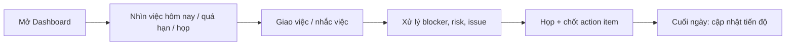
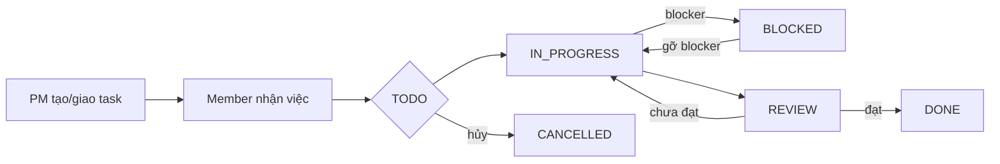
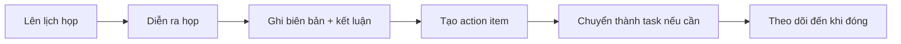
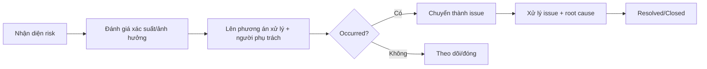

# 01 — Yêu cầu nghiệp vụ (Business Requirements)

> Dự án: PM Daily Work Management
> Trạng thái: Draft — nguồn chính từ Prompt 01/02 của bộ prompt đã thống nhất.
> Tài liệu liên quan: `docs/00-project-overview.md`, `docs/02-functional-requirements.md`, `docs/04-business-rules.md`.

## 1. Bối cảnh

Quản lý dự án phần mềm thường phải nắm đồng thời nhiều nguồn thông tin: công việc hằng ngày, deadline, cuộc họp, action item, risk, issue, milestone. Hiện trạng các PM phải theo dõi bằng file Excel/nháp nhiều chỗ, dễ sót việc quá hạn, sót action item sau họp, thiếu một góc nhìn tổng thể về tình trạng dự án.

Ứng dụng **PM Daily Work Management** là công cụ nội bộ giúp PM và thành viên dự án:

- Tập trung mọi thông tin vận hành dự án tại một nơi.
- Theo dõi công việc hằng ngày và xử lý kịp thời công việc quá hạn/blocker.
- Ghi nhận cuộc họp, biên bản và đảm bảo action item được theo dõi tới khi hoàn thành.
- Chủ động quản lý risk/issue/milestone thay vì phản ứng khi đã xảy ra.

## 2. Mục tiêu nghiệp vụ

| # | Mục tiêu | Cách đo (gợi ý) |
|---|---|---|
| 1 | PM nắm toàn cảnh công việc trong ngày tại một màn hình | % ngày làm việc mở Dashboard; giảm thao tác tra cứu thủ công |
| 2 | Không sót công việc quá hạn hoặc blocker | Số task quá hạn/blocker tồn đọng trên 3 ngày giảm dần |
| 3 | Mọi action item của cuộc họp được theo dõi đến khi đóng | % action item được đóng đúng hạn |
| 4 | Risk/issue được phát hiện và xử lý sớm | Giảm thời gian trung bình xử lý issue |
| 5 | Tiến độ dự án minh bạch, có báo cáo nhanh | Có báo cáo theo trạng thái/người thực hiện/dự án trong 1 lần truy cập |
| 6 | Mọi thay đổi quan trọng có vết (audit) | Truy vấn được lịch sử thay đổi của task/họp/risk/issue |

## 3. Stakeholders

| Stakeholder | Vai trò | Nhu cầu chính |
|---|---|---|
| PM (quản lý dự án) | Người dùng chính | Dashboard, giao việc, họp, risk/issue/milestone, báo cáo |
| Thành viên dự án | Người thực hiện | Xem việc được giao, cập nhật trạng thái/tiến độ, nhận thông báo |
| Admin | Người vận hành hệ thống | Quản lý tài khoản, vai trò, xem audit |
| Viewer (lãnh đạo/khách) | Người xem | Xem tiến độ, báo cáo, không thao tác |
| DevOps (gián tiếp) | Vận hành local | Docker Compose, environment, log, migration |

## 4. Người dùng đại diện (Personas)

**Persona 1 — PM: anh Minh, 35 tuổi, quản lý 2–3 dự án song song.**
Buổi sáng muốn nhìn nhanh: hôm nay có việc gì, việc nào quá hạn, họp nào, action item nào đang nợ. Trong ngày: giao việc, theo dõi blocker, tổ chức họp và chốt action item. Cuối tuần: báo cáo tiến độ.

**Persona 2 — Developer: chị Lan, thành viên dự án.**
Muốn biết việc mình được giao, việc nào gần đến hạn, cập nhật trạng thái/tiến độ nhanh, được nhắc khi có comment/bình luận mới. Không cần và không được phép sửa dữ liệu ngoài phạm vi việc của mình.

**Persona 3 — Admin: anh Đức.**
Tạo tài khoản, gán vai trò, vô hiệu hóa tài khoản, kiểm tra nhật ký khi cần.

## 5. Quy trình nghiệp vụ cấp cao

### 5.1 Vòng vận hành hằng ngày của PM

### 5.2 Quy trình công việc

### 5.3 Quy trình họp → action item → task

### 5.4 Quy trình risk / issue

## 6. Nhóm chức năng nghiệp vụ

| # | Nhóm chức năng | Mô tả nghiệp vụ | Giá trị |
|---|---|---|---|
| 1 | Đăng nhập & tài khoản | Xác thực JWT, refresh token, đổi mật khẩu, Admin quản lý tài khoản | Kiểm soát truy cập |
| 2 | Dashboard hằng ngày | Tổng quan việc hôm nay/quá hạn/sắp đến hạn/blocker, họp hôm nay, action item, risk cao, issue mở, milestone, biểu đồ | Ra quyết định nhanh |
| 3 | Quản lý dự án | CRUD dự án, theo dõi trạng thái, ngày bắt đầu/kết thúc, tiến độ | Có hồ sơ dự án |
| 4 | Quản lý thành viên | Thêm/xóa thành viên, gán vai trò trong dự án | Đảm bảo đúng người đúng việc |
| 5 | Quản lý công việc | CRUD task, giao việc, trạng thái, tiến độ, blocker, cha/con, bình luận, file, lịch sử, tìm kiếm/lọc/phân trang, xuất Excel | Vận hành hằng ngày |
| 6 | Công việc cá nhân của PM | Việc của tôi, việc hôm nay, việc quá hạn | Ưu tiên xử lý đúng lúc |
| 7 | Quản lý cuộc họp | Lên lịch, người tham gia, biên bản, kết luận | Chốt việc sau họp |
| 8 | Biên bản & action item | Action item theo họp, chuyển thành task, theo dõi quá hạn | Không sót việc sau họp |
| 9 | Quản lý risk | Nhận diện, đánh giá, phương án xử lý, theo dõi | Chủ động giảm thiểu |
| 10 | Quản lý issue | Ghi nhận, root cause, giải pháp, xử lý | Xử lý sớm, học hỏi |
| 11 | Quản lý quyết định | V1: ghi nhận qua biên bản/notes + audit | Lưu vết quyết định |
| 12 | Quản lý milestone | Kế hoạch/thực tế, trạng thái, tiến độ | Bám tiến độ lớn |
| 13 | Nhắc việc | In-app notification: giao việc, sắp đến hạn, quá hạn, comment, họp, action item | Không sót việc |
| 14 | Báo cáo tiến độ | Task theo trạng thái/người/quá hạn, tiến độ dự án, risk/issue, export | Báo cáo nhanh |
| 15 | Nhật ký hoạt động | Audit log hành động quan trọng | Truy vết, trách nhiệm |

## 7. Chỉ số nghiệp vụ (KPI gợi ý theo dõi)

- Số task quá hạn/blocker đang mở.
- % action item đóng đúng hạn.
- Số risk mức HIGH/CRITICAL đang mở.
- Số issue chưa xử lý và tuổi trung bình của issue mở.
- Tiến độ trung bình các dự án ACTIVE.
- Số milestone trễ so với kế hoạch.

## 8. Ranh giới phạm vi

**Trong phạm vi v1:** toàn bộ 15 nhóm chức năng ở mục 6; in-app notification; chạy local bằng Docker Compose trên Windows; báo cáo export CSV/Excel nếu thư viện ổn định.

**Ngoài phạm vi v1:** email/SMS, realtime (WebSocket), mobile app, multi-tenant, đa ngôn ngữ, CI/CD production, module quyết định tách riêng (ghi nhận qua biên bản/notes + audit).

## 9. Điểm cần xác nhận (nghiệp vụ)

1. UI/message tiếng Việt — xác nhận lần cuối?
2. Quản lý quyết định (nhóm 11): v1 ghi nhận qua biên bản/notes + audit là đủ, hay cần bảng `decisions` riêng?
3. Nhận việc (accept): bắt buộc member phải "nhận việc" trước khi chuyển IN_PROGRESS, hay chỉ là trạng thái hiển thị?
4. Export Excel: cần cho task và báo cáo, hay chỉ báo cáo?
5. Quy mô người dùng tối đa dự kiến (để chốt hiệu năng và phân trang)?
