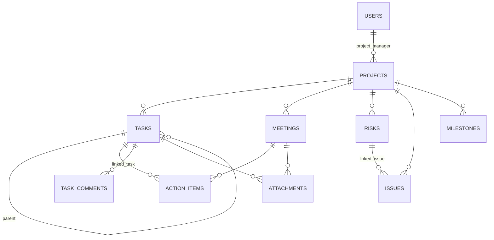
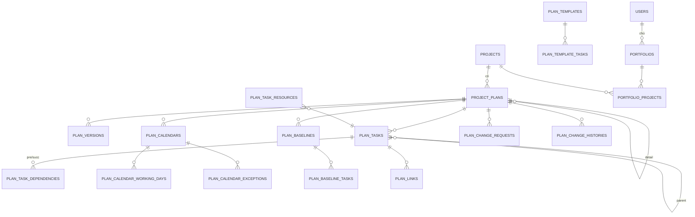

# Database 05 — ER Diagram

> Dự án: PM Daily Work Management | Trạng thái: Draft
> Chú thích: `*` = cột chuẩn (id, version, created_at/by, updated_at/by, [deleted_at/by]) — xem `01-data-model.md` mục 4.

```mermaid
erDiagram
    USERS ||--o{ USER_ROLES : "có"
    USERS ||--o{ ROLE_PERMISSIONS : ""
    ROLES ||--o{ USER_ROLES : "gồm"
    ROLES ||--o{ ROLE_PERMISSIONS : "gồm"
    PERMISSIONS ||--o{ ROLE_PERMISSIONS : ""
    USERS ||--o{ REFRESH_TOKENS : "sở hữu"

    USERS ||--o{ PROJECTS : "quản lý"
    PROJECTS ||--o{ PROJECT_MEMBERS : "có"
    USERS ||--o{ PROJECT_MEMBERS : "tham gia"
    PROJECTS ||--o{ TASKS : "chứa"
    TASKS ||--o{ TASKS : "cha-con"
    USERS ||--o{ TASKS : "giao"
    USERS ||--o{ TASKS : "thực hiện"
    TASKS ||--o{ TASK_ASSIGNEES : "phối hợp"
    USERS ||--o{ TASK_ASSIGNEES : ""
    TASKS ||--o{ TASK_WATCHERS : "theo dõi"
    USERS ||--o{ TASK_WATCHERS : ""
    TASKS ||--o{ TASK_COMMENTS : "có"
    TASKS ||--o{ TASK_TAGS : ""
    TAGS ||--o{ TASK_TAGS : ""

    PROJECTS ||--o{ MEETINGS : "có"
    USERS ||--o{ MEETINGS : "chủ trì"
    MEETINGS ||--o{ MEETING_PARTICIPANTS : "có"
    USERS ||--o{ MEETING_PARTICIPANTS : ""
    MEETINGS ||--o{ ACTION_ITEMS : "phát sinh"
    PROJECTS ||--o{ ACTION_ITEMS : ""
    USERS ||--o{ ACTION_ITEMS : "phụ trách"
    TASKS ||--o{ ACTION_ITEMS : "liên kết"
    TASKS ||--o{ ATTACHMENTS : "có file"
    MEETINGS ||--o{ ATTACHMENTS : "có file"

    PROJECTS ||--o{ RISKS : "có"
    USERS ||--o{ RISKS : "phụ trách"
    ISSUES ||--o{ RISKS : "liên kết"
    PROJECTS ||--o{ ISSUES : "có"
    USERS ||--o{ ISSUES : "phụ trách"
    PROJECTS ||--o{ MILESTONES : "có"

    USERS ||--o{ NOTIFICATIONS : "nhận"
    USERS ||--o{ AUDIT_LOGS : "thực hiện"
    PROJECTS ||--o{ PROJECT_PLANS : "có plan"
    PROJECT_PLANS ||--o{ PROJECT_PLANS : "master-detail"
    PROJECT_PLANS ||--o{ PLAN_VERSIONS : "có version"
    PROJECT_PLANS ||--o{ PLAN_TASKS : "có WBS"
    PLAN_TASKS ||--o{ PLAN_TASKS : "cha-con"
    PLAN_TASKS ||--o{ PLAN_TASK_DEPENDENCIES : "predecessor"
    PLAN_TASKS ||--o{ PLAN_TASK_DEPENDENCIES : "successor"
    PLAN_CALENDARS ||--o{ PROJECT_PLANS : "calendar"
    PLAN_CALENDARS ||--o{ PLAN_CALENDAR_WORKING_DAYS : ""
    PLAN_CALENDARS ||--o{ PLAN_CALENDAR_EXCEPTIONS : ""
    PLAN_TASKS ||--o{ PLAN_TASK_RESOURCES : "gán resource"
    USERS ||--o{ PLAN_TASK_RESOURCES : ""
    PROJECT_PLANS ||--o{ PLAN_BASELINES : "có baseline"
    PLAN_BASELINES ||--o{ PLAN_BASELINE_TASKS : ""
    PLAN_TASKS ||--o{ PLAN_LINKS : "liên kết"
    PROJECT_PLANS ||--o{ PLAN_CHANGE_REQUESTS : ""
    PROJECT_PLANS ||--o{ PLAN_CHANGE_HISTORIES : ""
    PLAN_TEMPLATES ||--o{ PLAN_TEMPLATE_TASKS : ""
    USERS ||--o{ PORTFOLIOS : "sở hữu"
    PORTFOLIOS ||--o{ PORTFOLIO_PROJECTS : ""
    PROJECTS ||--o{ PORTFOLIO_PROJECTS : ""
```

## Các quan hệ một–một (unique)

| Quan hệ | Bảng | Ràng buộc |
|---|---|---|
| Action item ⇔ Task (sau chuyển đổi) | `action_items.linked_task_id` | UNIQUE — 1 AI tối đa 1 task |
| Risk ⇔ Issue (khi OCCURRED) | `risks.linked_issue_id` | UNIQUE — 1 risk tối đa 1 issue |

## Sơ đồ rút gọn (không bảng mapping)

## Planning (v1.1 — tóm tắt ngoài "sơ đồ rút gọn v1.0")

## Ghi chú về quan hệ cha–con task

- `tasks.parent_task_id` tự tham chiếu (self-FK), mức 1 cấp được khuyến nghị trong UI; hệ thống cho phép nhiều cấp nhưng **chặn vòng lặp** ở tầng service (BR-TASK-08).
- Ràng buộc "task con cùng project với cha" do service kiểm tra (không ép ở DB — vì có thể cần di chuyển task giữa project ở phiên bản sau).
