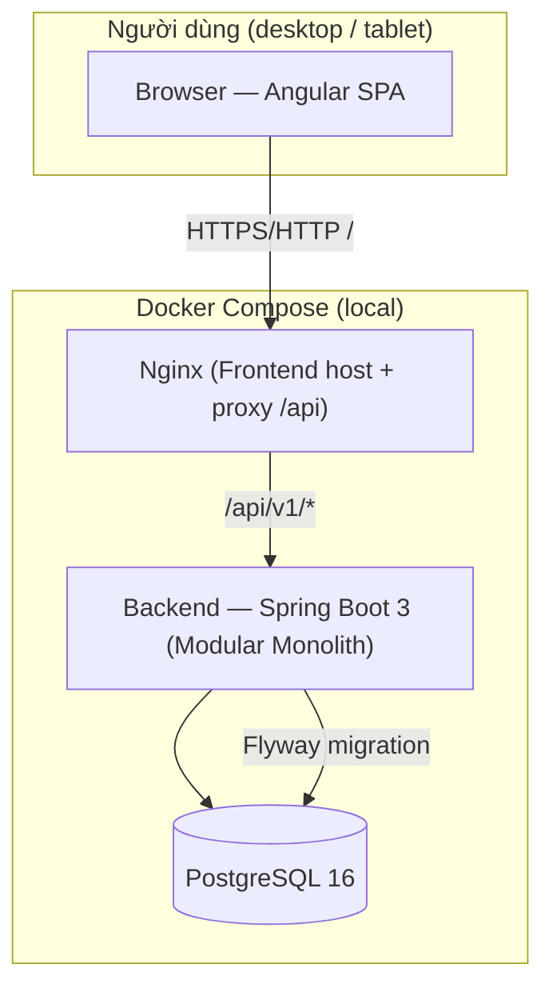
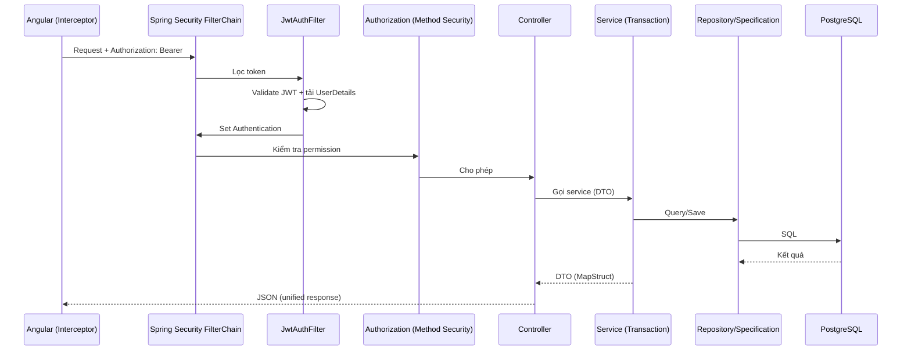
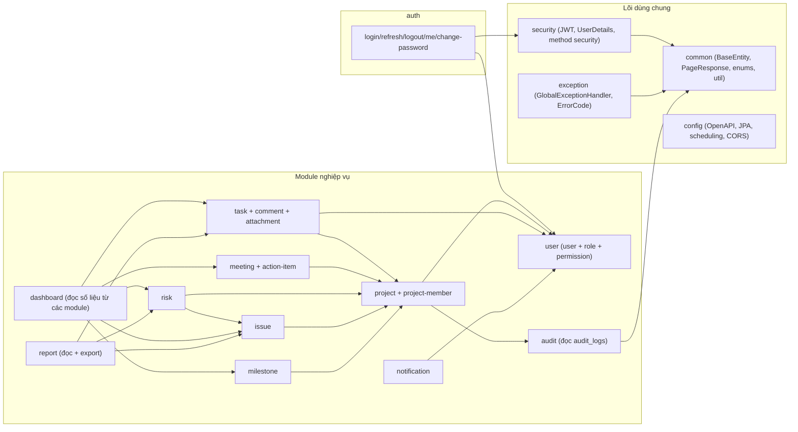
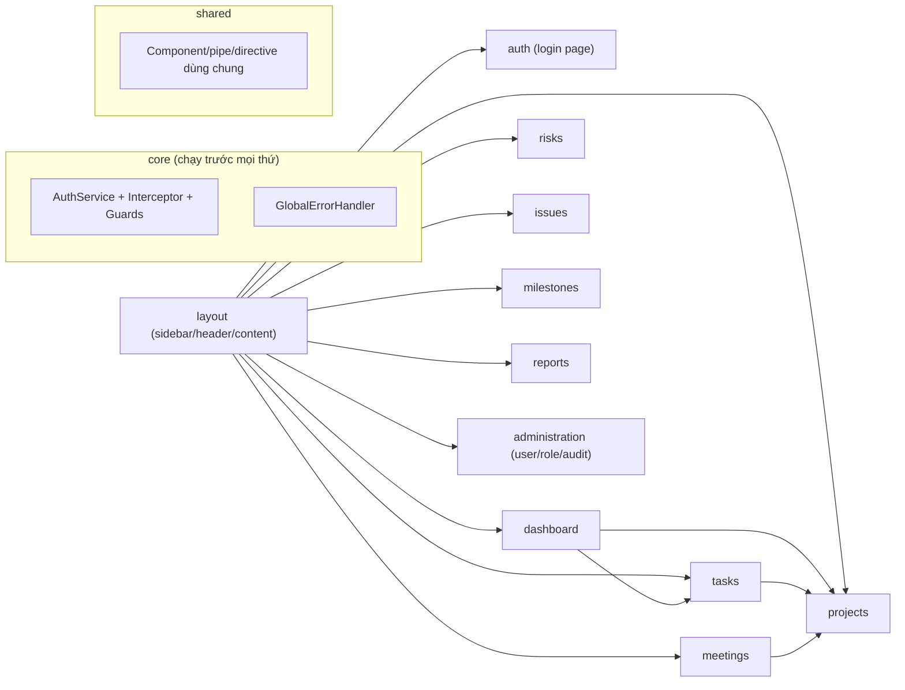

# Design 01 — Kiến trúc hệ thống (System Architecture)

> Dự án: PM Daily Work Management | Trạng thái: Draft
> Nguồn: Prompt 04, `docs/00-project-overview.md`, `docs/02-functional-requirements.md`

## 1. Quyết định kiến trúc (ADR)

| # | Quyết định | Lý do | Trade-off |
|---|---|---|---|
| ADR-01 | **Modular Monolith** cho v1 (1 ứng dụng Spring Boot, 1 DB) | Ứng dụng nội bộ quy mô nhỏ–vừa; triển khai đơn giản; giữ nguyên khả năng tách microservice sau này vì ranh giới module đã rõ | Không scale độc lập từng module; một lỗi nặng ảnh hưởng toàn app |
| ADR-02 | **Layered Architecture theo module** (controller → service → repository) kèm `entity/dto/mapper/specification` | Đơn giản, dễ hiểu, đúng chuẩn Spring; không cần Clean Architecture trừu tượng cho quy mô này | Ràng buộc import giữa module phải tự giác duy trì |
| ADR-03 | **REST API `/api/v1` + JSON + ISO-8601** | Chuẩn, công cụ hỗ trợ tốt | — |
| ADR-04 | **JWT access token ngắn (15') + refresh token (7 ngày) lưu DB, có revoke** | Bảo mật hợp lý, chủ động vô hiệu phiên | Cần lưu trữ + xử lý rotation |
| ADR-05 | **Angular feature modules + service/RxJS (không NgRx)** | Quy mô UI vừa; ít boilerplate; đủ dùng cho nhu cầu hiện tại | State chia sẻ phức tạp hơn khi app lớn |
| ADR-06 | **1 PostgreSQL DB duy nhất**, schema theo module | Đơn giản, dễ migration | Có thể cần tách sau |
| ADR-07 | **Docker Compose chạy local** (postgres + backend + frontend/nginx) | Đồng nhất môi trường trên Windows | Chi phí bộ nhớ Docker |
| ADR-08 | **Specification pattern cho filter task (động)** | Task có nhiều điều kiện lọc; tránh viết query thủ công | Phức tạp hơn query cố định |
| ADR-09 | **Optimistic locking (version) + soft delete** | Chống mất dữ liệu khi cập nhật đồng thời; giữ lịch sử dữ liệu | Cần quy ước truy vấn loại dữ liệu đã xóa |
| ADR-10 | **Flyway quản lý migration** | Kiểm soát schema theo phiên bản | Quy trình phải kỷ luật (không sửa migration đã chạy) |

## 2. Kiến trúc tổng thể

## 3. Vòng đời request

## 4. Cấu trúc module Backend

**Quy tắc phụ thuộc:**
1. Module nghiệp vụ chỉ phụ thuộc `core` (common/security/exception/config) và module "thấp hơn" (user, project).
2. Cấm module nghiệp vụ import chéo ngang hàng ngoài danh sách cho phép (VD task không import meeting).
3. `dashboard`/`report`/`audit` chỉ **đọc** qua repository/service của module sở hữu dữ liệu — không truy cập Entity module khác trực tiếp qua join tùy ý (ngoại lệ: query aggregate hợp lý được phép, phải review).
4. Không module nào import `controller` của module khác.

## 5. Cấu trúc module Frontend

- **Lazy loading** theo feature module; route guard kiểm tra auth + permission trước khi load.
- Feature module chỉ dùng `core` + `shared`, không import module feature khác (trừ điều hướng qua route).

## 6. Luồng dữ liệu chính

| Luồng | Mô tả | Chi tiết |
|---|---|---|
| Đăng nhập | Login → lưu token → điều hướng | `docs/design/03-frontend-architecture.md` mục 5 |
| Refresh token | Hết hạn → refresh 1 luồng duy nhất → retry queue | `docs/design/03` mục 6, `docs/design/04` mục 3 |
| Danh sách task | Filter → Specification → Query → PageResponse | `docs/design/02` mục 7 |
| Dashboard | Aggregate DB → DTO → UI | `docs/design/02` mục 9 |
| Notification | Sự kiện nghiệp vụ → tạo notification → job dedupe deadline | `docs/design/02` mục 10 |

## 7. Trade-off tổng thể

| Chọn | Bỏ | Chấp nhận khi |
|---|---|---|
| Modular monolith | Microservice | Quy mô ≤ vài trăm user, team nhỏ, 1 DB |
| Service + RxJS | NgRx | State ít dùng chung toàn cục ngoài auth + notification |
| 1 DB | Tách DB theo module | Vẫn giữ schema tách module rõ ràng để tách sau |
| Access 15' + refresh 7 ngày | Session server-side | Chấp nhận nỗ lực revoke qua bảng refresh_tokens |
