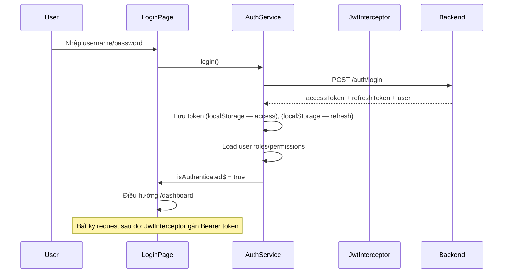

# Design 03 — Kiến trúc Frontend (Angular)

> Dự án: PM Daily Work Management | Trạng thái: Draft
> Nguồn: Prompt 04, `docs/02-functional-requirements.md`, `docs/05-user-roles-permissions.md`

## 1. Tổ chức thư mục

```
frontend/src/app/
├── core/                    # Load 1 lần, không import bởi feature
│   ├── auth/                # AuthService, token storage, refresh logic
│   ├── interceptors/        # JwtInterceptor, ErrorInterceptor
│   ├── guards/              # AuthGuard, PermissionGuard
│   ├── error/               # GlobalErrorHandler
│   ├── loading/             # LoadingInterceptor + spinner service
│   └── notification/        # In-app notification service (unread count)
├── shared/                  # Dùng được ở mọi feature
│   ├── components/          # ConfirmDialog, EmptyState, PageHeader, StatusChip, PriorityChip...
│   ├── directives/          # HasPermissionDirective
│   ├── pipes/               # timezone, truncate...
│   └── models/              # Interface DTO dùng chung (PageResponse, ErrorResponse)
├── layout/                  # Sidebar, Header, MainLayout (routing shell)
├── auth/                    # LoginPage
├── dashboard/
├── projects/                # list, form, detail (tabs: tổng quan/member/task/meeting/risk/issue/milestone)
├── tasks/                   # list, my-tasks, today, overdue, form, detail (comments/history/children)
├── meetings/                # list, form, detail (participants, action items)
├── risks/
├── issues/
├── milestones/
├── reports/
└── administration/          # users, roles, audit log
```

## 2. Nguyên tắc module

1. **Lazy loading** mọi feature module qua route (`loadChildren`); `core` + `shared` load ở root.
2. **Cấm** feature import feature; muốn điều hướng → dùng `Router` (route name, không import trực tiếp).
3. `core` chỉ được import bởi `AppModule`; `shared` import bởi mọi nơi.
4. Mỗi feature: `XxxModule` + `pages/` (route components) + `components/` (dùng nội bộ) + `services/` + `models/`.

## 3. Component structure (1 màn hình)

```
TaskListComponent (container: đọc params → gọi service → quản lý state list)
├── TaskFilterComponent (form filter → emit)
├── TaskTableComponent (presentational: @Input list, @Output events)
├── EmptyStateComponent
└── ConfirmDialogComponent (shared)
```

- **Container** nắm dữ liệu/state; **presentational** chỉ nhận Input + phát Output — dễ test.
- Service feature: `getList(filter): Observable<PageResponse<Task>>` — trả observable; container subscribe, tự `takeUntilDestroyed`.

## 4. Service & state management (không NgRx)

- Mỗi feature có `XxxService` gọi API (HttpClient) + giữ **state cục bộ** bằng `BehaviorSubject` nếu cần dùng chung trong feature.
- State toàn cục tối thiểu, chỉ trong `core`:
  - `AuthService`: `currentUser$` (roles/permissions), `isAuthenticated$`.
  - `NotificationService`: `unreadCount$` (poll hoặc refresh sau hành động).
- Không dùng NgRx (ADR-05); khi nào cần NgRx → đánh giá lại khi state chia sẻ vượt tầm.

## 5. Luồng đăng nhập



- Access token: lưu **localStorage** (app SPA nội bộ — ghi chú rủi ro XSS ở design 04; không dùng cookie để tránh CSRF).
- Không log token ở bất kỳ đâu (console/tool).

## 6. Luồng refresh token (chống gọi song song)

```mermaid
sequenceDiagram
    participant C as Component
    participant I as JwtInterceptor
    participant A as AuthService
    participant B as Backend

    C->>I: Request (token hết hạn)
    I->>A: Số request đồng thời đang chờ refresh
    Note over A: refreshInFlight = false
    A->>A: refreshInFlight = true; isRefreshing$ = true
    A->>B: POST /auth/refresh
    B-->>A: token mới
    A->>A: Cập nhật token; refreshInFlight = false
    A->>I: Retry request ban đầu
    I->>B: Gửi lại request kèm token mới
    Note over A: Các request khác cùng đợi isRefreshing$ (single-flight)
```

- Cơ chế: `isRefreshing$` BehaviorSubject; request gặp 401 → nếu chưa có luồng refresh thì khởi động 1 luồng duy nhất, các request còn lại `switchMap` chờ luồng đó rồi retry.
- Refresh thất bại (401): revoke local, điều hướng `/auth/login`.
- Không vòng lặp retry: request refresh không gọi lại interceptor.

## 7. JwtInterceptor & ErrorInterceptor

**JwtInterceptor:** gắn `Authorization: Bearer <accessToken>`; bỏ qua login/refresh; 401 → refresh flow.

**ErrorInterceptor:**
| Tình huống | Xử lý |
|---|---|
| 401 (sau refresh thất bại) | Logout, về login |
| 403 | Điều hướng trang 403 (nếu điều hướng) hoặc snackbar |
| 400 / 409 | Chuyển `fieldErrors` về form (đặt error vào từng control) |
| 404 | Snackbar + điều hướng 404 nếu cần |
| 0 / timeout / network | Snackbar "Không thể kết nối máy chủ" |

## 8. Route guard & permission

- `AuthGuard` (`canActivate`): chưa đăng nhập → `/auth/login`.
- `PermissionGuard`: `canActivate(route, state)` đọc `data.permissions` từ route config → kiểm tra trong `currentUser.permissions` → không đủ → `/403`.
- `HasPermissionDirective`: ẩn element (menu item, nút) khi thiếu permission — **chỉ là UX**, Backend vẫn là nguồn kiểm tra cuối.
- Menu sidebar: render động theo permissions (docs/05 mục 6.7).

## 9. Loading / Empty / Error state

| State | Cách làm |
|---|---|
| Loading | `LoadingInterceptor` + `LoadingService` → thanh progress/spinner toàn cục; skeleton (Material `mat-skeleton`) cho list/dashboard |
| Empty | `EmptyStateComponent` (icon + message + action tùy chọn) |
| Error | `ErrorStateComponent` (message + nút Retry); lỗi API hiển thị qua snackbar/form |

## 10. Form quy tắc chung (Reactive Forms)

1. Form model khớp Request DTO Backend; validator tương ứng (required, maxLength, min/max, pattern; cross-field: dueDate ≥ startDate qua validator trên FormGroup).
2. **Không submit khi invalid**; nút submit disabled + chống double click (flag `submitting`).
3. Lỗi từ Backend (`fieldErrors`) → `form.setErrors`/đặt vào control; **không mất dữ liệu đang nhập** khi API lỗi.
4. Optimistic lock: khi nhận 409 → dialog "Dữ liệu đã bị thay đổi bởi người khác" → nút "Tải lại dữ liệu mới" (load bản ghi mới + merge).
5. Select assignee/collaborator: danh sách lọc theo project (không cho chọn người ngoài dự án); select parent task chỉ hiển thị task cùng project.

## 11. Environment & API base URL

- `environment.ts` (dev): `apiUrl: '/api/v1'` (qua proxy dev server `/api` → backend) hoặc URL trực tiếp theo env.
- `environment.prod.ts`: cùng path tương đối — Nginx proxy `/api` → backend (design 07).
- Không hard-code URL trong service; không đưa secret vào Frontend.

## 12. Ngày giờ & timezone

- Lưu trữ: ISO-8601 UTC (nhận từ API).
- Hiển thị: chuyển về giờ trình duyệt user (pipe chung `formatDate` + `timezone`).
- "Hôm nay" (tasks/today, meetings/today, dashboard): gửi kèm timezone offset của client (`tz` param) — Backend tính theo timezone user.
- Calendar/datepicker Material: dùng locale theo trình duyệt.

## 13. Test chiến lược

| Đối tượng | Test |
|---|---|
| Service | Jasmine: gọi HTTP đúng URL/method, map response, xử lý lỗi |
| Interceptor | Refresh single-flight (2 request cùng 401 → chỉ 1 lần gọi refresh, cả 2 retry) |
| Guard | Auth/Permission quyết định đúng |
| Component | Container: load list, filter emit, empty/error state; Form: validation, chống double submit, 409 conflict UI |
| Pipes/directive | HasPermission ẩn/hiện đúng |
