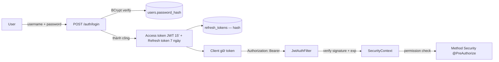

# Design 04 — Thiết kế bảo mật (Security Design)

> Dự án: PM Daily Work Management | Trạng thái: Prompt 09 hoàn tất (2026-08-02)
> Nguồn: Prompt 04, `docs/03-non-functional-requirements.md` (NFR-SEC), `docs/04-business-rules.md` (BR-AUTH), `docs/05-user-roles-permissions.md`

## 1. Mô hình xác thực

## 2. JWT access token

- Thuật toán: `HS256` (secret ≥ 256-bit từ env `JWT_SECRET`).
- Claims: `sub (userId)`, `username`, `roles[]`, `permissions[]`, `iat`, `exp` (15 phút, config `JWT_ACCESS_EXPIRATION`).
- Không nhúng thông tin nhạy cảm (không email/password/address...).
- Validate: chữ ký + exp; không dùng JWT từ blacklist (vì thời gian sống ngắn) — vô hiệu phiên qua refresh token.

## 3. Refresh token

| Thuộc tính | Giá trị |
|---|---|
| Lưu trữ | Bảng `refresh_tokens`: `id, user_id, token_hash (SHA-256), expires_at, revoked_at, replaced_by, created_at` |
| Thời hạn | 7 ngày (config `JWT_REFRESH_EXPIRATION`) |
| Cấp lại | Rotation: cấp cặp mới, revoke token cũ (`replaced_by`) |
| Reuse detection | Token revoked bị dùng lại → revoke toàn bộ token của user (BR-AUTH-09 — BẮT BUỘC) |
| Revoke khi | Logout, đổi mật khẩu, reset mật khẩu, user bị INACTIVE |

**Lưu hash** (không lưu plaintext refresh token): chỉ so khớp hash → đánh cắp DB không dùng được token.

**Ghi chú implement (Prompt 09):** `login` và `refresh` dùng `@Transactional(noRollbackFor = BusinessException.class)` — nếu không, ghi attempts/lock (BR-AUTH-08) và revoke chain (BR-AUTH-09) sẽ bị rollback khi ném exception nghiệp vụ.

## 4. Mật khẩu & chính sách

- BCrypt strength ≥ 10 (config).
- Policy: ≥ 8 ký tự, thường + hoa + số + ký tự đặc biệt (BR-AUTH-02).
- Không trả/lọc/ghi log password hash; error message chung khi login sai (BR-AUTH-05).
- Khóa tạm thời sau 5 lần sai liên tiếp (BR-AUTH-08 — BẮT BUỘC; tham số hóa `LOGIN_MAX_FAILED_ATTEMPTS` / `LOGIN_LOCK_DURATION_MINUTES`): lần sai thứ 5 → `ACCOUNT_LOCKED` (HTTP 423) + `locked_until`, counter reset; khi khóa còn hiệu lực, login đúng mật khẩu cũng bị từ chối.

## 5. Phân quyền (Authorization)

- **Permission-based**: user → roles → permissions (bảng `roles`, `permissions`, `user_roles`, `role_permissions`).
- Backend: `@PreAuthorize("hasAuthority('task:update')")` trên method controller/service.
- **Kiểm tra phạm vi dữ liệu** ở Service (không chỉ dừng ở quyền toàn cục):
  - Thành viên thao tác dữ liệu dự án phải thuộc `project_members` (trừ ADMIN).
  - PM dự án = user có quyền + vai trò PROJECT_MANAGER trong project_members của dự án đó.
  - Member chỉ sửa task mình là assignee (giới hạn trường status/progress/notes).
- Whitelist sort field; không tin input để build query.

## 6. CORS & bảo vệ tầng HTTP

- CORS: chỉ cho phép `CORS_ALLOWED_ORIGINS` (dev: http://localhost:4200); cấm `*` với credentials; `allowCredentials=true` chỉ khi origin cụ thể.
- Không cần CSRF token: dùng JWT trong header Authorization (không dùng cookie) → không bị CSRF tấn công theo cơ chế cookie; vẫn mở `csrf.disable()` (stateless) — ghi chú trong code.
- Security headers: `X-Content-Type-Options: nosniff`, `X-Frame-Options: DENY`, `Cache-Control: no-store` cho response có dữ liệu nhạy cảm.

## 7. Phòng chống lỗ hổng cơ bản

| Lỗ hổng | Phòng chống |
|---|---|
| SQL Injection | JPA/JPQL tham số hóa; Specification không nối input thô; native query dùng named parameter |
| XSS | Angular escape mặc định (interpolation); không dùng `innerHTML` với dữ liệu user; cấu hình CSP nếu deploy Nginx |
| Path traversal (file) | Validate tên file, lưu path do server sinh (UUID), không lưu path user cung cấp |
| Upload độc hại | Giới hạn kích thước 10MB, whitelist mime type, từ chối file thực thi (exe, js...) |
| Brute force login | Khóa tạm thời sau N lần sai (BR-AUTH-08) |
| Information disclosure | Error response ẩn stack trace; login message chung; không tiết lộ user tồn tại |
| JWT secret yếu | Fail fast nếu `JWT_SECRET` thiếu hoặc < 32 ký tự khi start |

## 8. Bảo vệ dữ liệu nhạy cảm

- Không log: token, refresh token, password, JWT secret.
- API `GET /auth/me`, user DTO: **không bao giờ** chứa `passwordHash`.
- Audit log: che/bỏ các field nhạy cảm (VD không ghi toàn bộ password policy violation).
- Secret production: environment variable; `.env` không commit; `.env.example` chứa placeholder.

## 9. Checklist kiểm chứng (Prompt 09 — đã thực hiện; còn lại Prompt 26)

- [x] Test token hết hạn / không hợp lệ / sai signature (JwtServiceTest).
- [x] Test refresh token revoked / hết hạn / reuse → revoke chuỗi (AuthServiceTest + AuthIntegrationTest).
- [x] Test user INACTIVE login (message chung).
- [x] Test 403 khi thiếu permission (reset-password không có user:manage).
- [x] Test message login chung (không phân biệt user tồn tại).
- [x] Test không lộ password hash qua bất kỳ API nào.
- [x] Test khóa tạm thời 5 lần sai liên tiếp (423 ACCOUNT_LOCKED).
- [ ] Review log: không chứa token/password (Prompt 26).
