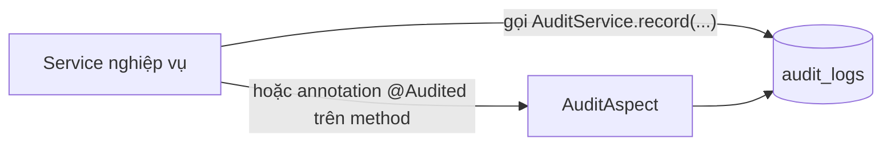

# Design 06 — Logging & Audit Design

> Dự án: PM Daily Work Management | Trạng thái: Draft
> Nguồn: Prompt 04, `docs/03-non-functional-requirements.md` (NFR-LOG, NFR-MNT-04)

## 1. Logging (SLF4J + Logback)

| Hạng mục | Quyết định |
|---|---|
| API | SLF4J (`LoggerFactory.getLogger(...)`) — chuẩn Spring Boot |
| Format | `%d{ISO8601} %-5level [%traceId] [%X{userId}] %logger{40} - %msg%n` |
| Trace ID | MDC `traceId` — filter sinh UUID mỗi request, thêm vào error response (design 05) |
| User ID | MDC `userId` — đặt sau khi xác thực (ẩn nếu anonymous) |
| Level mặc định | `INFO` (local: `DEBUG` optional); sensitive field cấm log |
| Exception | Log stack trace ở `ERROR` (server-side); client chỉ nhận message an toàn |

### Quy tắc log

1. **Cấm log**: password, access/refresh token, JWT secret, toàn bộ payload login.
2. Log nghiệp vụ ngắn gọn kèm id: `"task.create success taskId=... actorId=..."`.
3. Không log `toString()` của Entity chứa field nhạy cảm (nếu Entity có field như vậy → override toString cẩn thận).
4. `WARN` cho trạng thái bất thường nhưng xử lý được; `ERROR` cho exception; `INFO` cho sự kiện chính (login success, create/update/delete nghiệp vụ lớn).

## 2. Audit log — mô hình dữ liệu

Bảng `audit_logs`:

| Cột | Kiểu | Ghi chú |
|---|---|---|
| `id` | UUID | PK |
| `trace_id` | varchar(64) | Truy vết request |
| `actor_id` | UUID | Người thực hiện (nullable — hệ thống/job) |
| `actor_username` | varchar(100) | Tiện tra cứu |
| `action` | varchar(100) | `LOGIN_SUCCESS`, `TASK_CREATE`, `TASK_STATUS_CHANGE`, `PROJECT_UPDATE`, `MEMBER_ADDED`, `PASSWORD_CHANGED`, `PERMISSION_CHANGED`... |
| `entity_type` | varchar(50) | `TASK`, `PROJECT`, `MEETING`... |
| `entity_id` | UUID | Đối tượng |
| `before_data` | JSONB | Trạng thái trước (nullable) |
| `after_data` | JSONB | Trạng thái sau (nullable) |
| `created_at` | timestamptz | Thời điểm (UTC) |

## 3. Cơ chế ghi audit

- **Cách 1 (chủ đạo)**: Service gọi `AuditService.record(action, entityType, entityId, before, after)` ngay trong transaction nghiệp vụ — đơn giản, rõ ràng.
- **Cách 2 (hỗ trợ)**: annotation `@Audited(action = "...")` + `AuditAspect` cho các method thao tác Entity được đánh dấu (AOP bắt params/result để lưu before/after JSONB). Chỉ dùng khi việc gọi tay lặp lại quá nhiều.
- Không audit: request đọc (GET) trừ khi có nhu cầu đặc biệt (tránh phình bảng).
- Login/refresh/logout ghi qua `AuthenticationSuccessHandler`/service auth (action: `LOGIN_SUCCESS`, `LOGIN_FAILED`, `REFRESH_TOKEN`, `LOGOUT`).

## 4. Những hành động bắt buộc audit (BR-GEN-06)

| Nhóm | Hành động |
|---|---|
| Auth | login thành công/thất bại, logout, refresh, đổi/reset mật khẩu |
| User & role | tạo/sửa/vô hiệu hóa user, thay đổi role/permission |
| Project | tạo/sửa/xóa mềm, thêm/xóa/đổi vai trò thành viên |
| Task | tạo/sửa/xóa, đổi assignee, chuyển trạng thái, đổi progress (thay đổi đáng kể), upload/delete attachment |
| Meeting/AI | tạo/sửa/xóa, chuyển AI → task |
| Risk/Issue/Milestone | tạo/sửa/xóa, chuyển trạng thái, chuyển risk → issue |
| Report | export báo cáo (khuyến nghị) |

## 5. Truy vấn & giao diện admin

- API: `GET /api/v1/audit-logs` (filter: actorId, action, entityType, fromDate, toDate, page, size) — chỉ ADMIN (`audit:view`).
- Bảo mật: trước khi lưu, dữ liệu JSONB được **che field nhạy cảm** (không lưu password hash/token dù là before/after).
- Retention: giữ tối thiểu 1 năm (v1 không tự động purge — ghi chú vận hành).

## 6. Kiểm chứng (Prompt 09, 14, 26)

- [ ] Test login → có `LOGIN_SUCCESS`/`LOGIN_FAILED`.
- [ ] Test tạo task → có `TASK_CREATE` kèm after_data.
- [ ] Test update version cũ → không ghi đè audit (không tạo bản ghi sai lệch).
- [ ] Review: audit log không chứa token/password.
