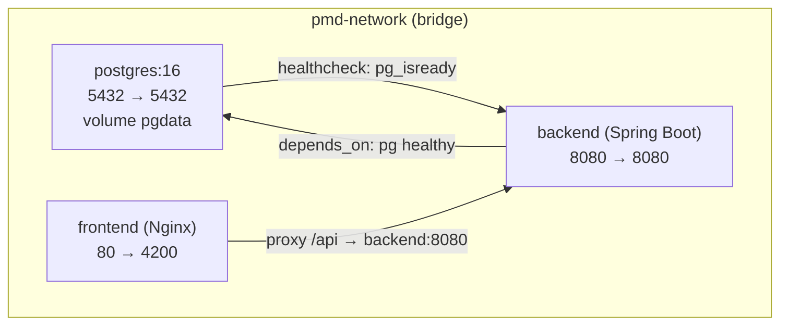

# Design 07 — Thiết kế triển khai local (Deployment Design)

> Dự án: PM Daily Work Management | Trạng thái: Draft — chạy local bằng Docker Compose (Windows) + phương án thủ công.
> Chi tiết vận hành: `docs/build/windows-local-runbook.md` (Prompt 25), `docs/build/docker-local-guide.md` (Prompt 24).

## 1. Tổng quan Docker Compose



| Service | Image/Dockerfile | Port (host → container) | Healthcheck |
|---|---|---|---|
| `postgres` | `postgres:16-alpine` | 5432 → 5432 | `pg_isready -U $POSTGRES_USER` |
| `backend` | `backend/Dockerfile` (multi-stage) | 8080 → 8080 | `GET /actuator/health` |
| `frontend` | `frontend/Dockerfile` (multi-stage + nginx) | 4200 → 80 | `GET /healthz` (nginx stub) |

## 2. Biến môi trường (`.env.example` → `.env`, không commit `.env`)

```dotenv
# PostgreSQL
POSTGRES_DB=pmdaily
POSTGRES_USER=pmdaily
POSTGRES_PASSWORD=change-me-local

# Backend
DB_URL=jdbc:postgresql://postgres:5432/pmdaily
DB_USERNAME=pmdaily
DB_PASSWORD=change-me-local
JWT_SECRET=change-me-local-secret-at-least-32-chars
JWT_ACCESS_EXPIRATION=900000
JWT_REFRESH_EXPIRATION=604800000
CORS_ALLOWED_ORIGINS=http://localhost:4200
SPRING_PROFILES_ACTIVE=local
```

- Backend container: dùng tên service `postgres` làm host; chạy thủ công local thì dùng `localhost:5432`.
- Không hard-code: mọi secret trong `.env`; nếu `JWT_SECRET` thiếu → backend fail fast khi start.

## 3. Dockerfile Backend (multi-stage)

```
Stage 1 build: maven:3.9-eclipse-temurin-21 → mvn clean package (skip tests ở image build? Không — chạy test rồi package)
Stage 2 run: eclipse-temurin:21-jre → COPY jar → ENTRYPOINT java -jar
```

## 4. Dockerfile Frontend (multi-stage) + Nginx

```
Stage 1 build: node:20-alpine (theo bản Node đã chốt) → npm ci → npm run build (production)
Stage 2 run: nginx:alpine → COPY dist → nginx.conf
```

`frontend/nginx.conf`:
- `location /` → SPA fallback `try_files $uri $uri/ /index.html;` (Angular route).
- `location /api/` → proxy_pass `http://backend:8080` (giữ prefix `/api/v1`).
- Static caching hợp lý (`index.html` no-cache; assets có cache fingerprint).

## 5. Các lệnh vận hành

| Lệnh | Mục đích |
|---|---|
| `docker compose up -d --build` | Build + start toàn bộ |
| `docker compose ps` | Kiểm tra trạng thái |
| `docker compose logs -f [service]` | Xem log |
| `docker compose down` | Dừng (giữ volume) |
| `docker compose down -v` | Dừng + xóa volume (reset DB) |
| `docker compose restart backend` | Restart 1 service |

## 6. Chạy thủ công (không Docker — Windows)

| Thành phần | Lệnh | Chuẩn bị |
|---|---|---|
| PostgreSQL | Docker riêng hoặc bản cài đặt local | DB `pmdaily`, user, password qua env |
| Backend | `cd backend; mvn clean test; mvn spring-boot:run -Dspring-boot.run.profiles=local` | `DB_URL=jdbc:postgresql://localhost:5432/pmdaily` |
| Frontend | `cd frontend; npm install; npm start` | Proxy dev `/api` → `http://localhost:8080` (angular.json) |
| Kiểm tra | Swagger `http://localhost:8080/swagger-ui.html`; Health `http://localhost:8080/actuator/health` | — |

## 7. Cấu hình theo môi trường (Backend)

| Profile | DB | Flyway | Seed | CORS |
|---|---|---|---|---|
| `local` | localhost/docker postgres | chạy V1 + V2 | V2 seed data demo | origin dev |
| `test` | DB test (Testcontainers hoặc H2 PG-mode — chốt khi implement) | chạy V1 | không seed | — |
| production (chưa dùng v1) | env var | chạy V1 | không seed | env var |

## 8. Migration & dữ liệu

- Flyway: `backend/src/main/resources/db/migration/V1__init_schema.sql`, `V2__seed_local_data.sql` (seed dành cho local — tài khoản demo ghi rõ trong README, password demo chỉ dùng local).
- `database/schema.sql` và `database/seed-data.sql` là bản tham chiếu cho migration (không chạy trực tiếp khi app chạy).
- Quy tắc: không sửa file migration đã chạy; thay đổi schema → tạo `V3__...`.

## 9. Port mặc định & xung đột

| Dịch vụ | Port | Lỗi hay gặp | Xử lý |
|---|---|---|---|
| PostgreSQL | 5432 | Port đã dùng (cài PostgreSQL local) | Đổi host port qua `.env` hoặc dừng dịch vụ local |
| Backend | 8080 | Port đã dùng | Đổi `BACKEND_PORT` compose |
| Frontend | 4200 | Port đã dùng (Angular dev) | `npm start -- --port 4201` |
| Frontend (Nginx) | 4200 | — | Đổi qua `.env` |

## 10. Các tệp dự kiến

```
docker-compose.yml
.env.example
backend/Dockerfile
frontend/Dockerfile
frontend/nginx.conf
scripts/start-local.ps1
scripts/stop-local.ps1
scripts/reset-local.ps1
scripts/smoke-test.ps1
docs/build/docker-local-guide.md     # Prompt 24
docs/build/docker-build-result.md    # Prompt 24
docs/build/windows-local-runbook.md  # Prompt 25
```

## 11. Kiểm chứng (Prompt 24/25)

- [ ] `docker compose up -d --build` chạy được trên Windows; cả 3 container healthy.
- [ ] Backend health 200; Swagger mở được; DB có migration V1 + V2.
- [ ] Frontend mở được, đăng nhập được bằng tài khoản demo seed.
- [ ] Proxy `/api` hoạt động (login qua nginx thành công).
- [ ] `docker compose down -v` rồi up lại → schema tự tạo lại (không lỗi migration).
